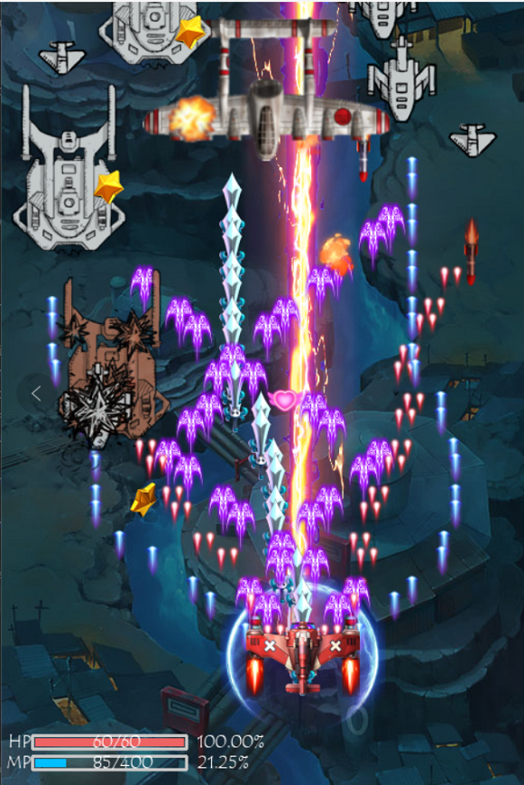

### Air Combat Game in Python ###
A shoot game written in Python
 

### Introduction ###
This project contains resources files in these two directories: 
```images```  and  ```music```
### Prerequisites ###
1. Python3
2. Python-Pygame
### Getting Started ###
Once this project is installed on your machine, go the ```project/main.py``` and type the line below on the terminal to lunch the game

       python main.py 
You can control your hero plane with your mouse and press the space bar to release ultimate skill
### Author ###
Ivan Chen
